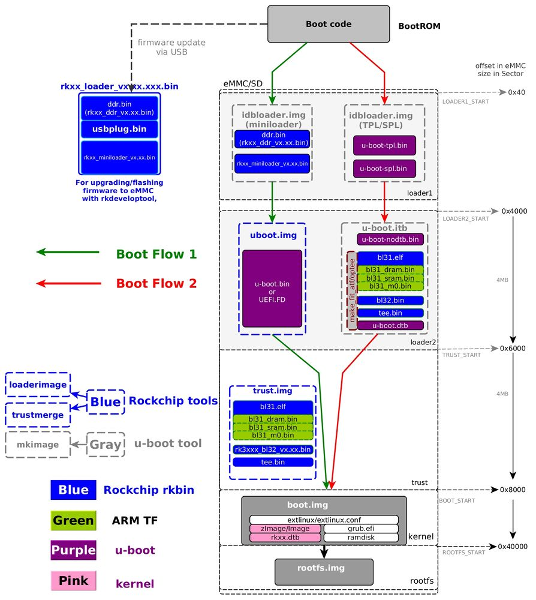

# Uboot启动分析
本文分析的芯片为Rockchip RK3399.
[参考文章](https://opensource.rock-chips.com/wiki_Boot_option#U-Boot)

## 启动流程
RK芯片支持两种启动方式，一种是U-boot TPL/TSL方式（开源），一种是使用RK idbLoader方式（闭源）

|Boot stage number|Terminology #1|Actual program name|Rockchip Image Name|Image Location(sector)||
| ---- | ---- | ---- | ---- | ---- | ---- |
|1|Primary Program Loader|ROM code| BootRom |      |      |
|2|Secondary Program Loader(SPL)|U-Boot TPL/SPL| idbloader.img | 0x40 | pre-loader |
|3|-|U-Boot| u-boot.itb uboot.img | 0x4000 | including u-boot and atf only used with miniloader |
|||ATF/TEE| trust.img | 0x6000 | only used with miniloader |
|4| - | kernel | boot.img | 0x8000 |      |
|5| - | rootfs | rootfs.img | 0x40000 |      |

### 不同启动方式流程区别
- Stage 1位于芯片boot rom（芯片厂商烧写，不可修改），它将载入Stage 2或Stage 3（开启SPL_BACK_TO_BROM选项时）
- SPI flash启动：Stage 2和Stage 3（SPL and U-boot方式）在SPI flash，stage 4/5在其他位置
- eMMC启动：所有阶段（Stage 2，3，4，5）在SD卡中
- SD卡启动：所有阶段（Stage 2，3，4，5）在SD卡中
- U-Disk启动：
- net/tftp启动：

- Boot Flow 1（绿线）是典型的使用RK miniloader的RK芯片启动流程
- Boot Flow 2（红线）为大部分SoC的U-Boot启动流程，TPL用于ddr初始化，SPL用于trust（ATF/OP-TEE）加载并运行至下一阶段

Note 1：如果 loader1 有超过 1 个Stage，程序将返回到BootROM，然后BootROM 加载并运行到下一Stage。例如，如果 loader1是tpl和spl，则BootROM将首先运行到 tpl，tpl 初始化ddr并返回到BootRoM，然后BootROM加载并运行到spl。
Note 2：如果启用了 trust，loader1 需要同时加载 trust 和 u-boot，然后在安全模式下运行到 trust（armv8 中的 EL3），trust 进行初始化并在非安全模式下运行到 U-Boot（armv8 中的 EL2）。
Note 3：对于trust（在trust.img或者u-boot.itb中），armv7只有一个tee.bin，可以带ta也可以不带ta，armv8有bl31.elf和可选的bl32。
Note 4：boot.img中内容可以为zImage及其dtb（Linux版），也可以为grub.efi，也可以为AOSP boot.img，ramdisk为选项；

## 启动文件解析
