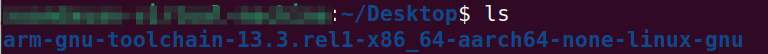
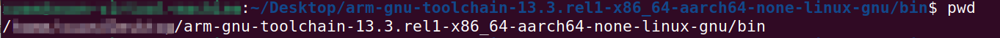
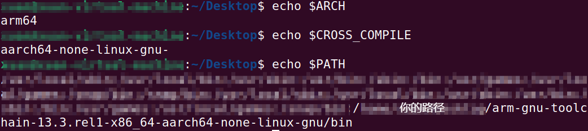
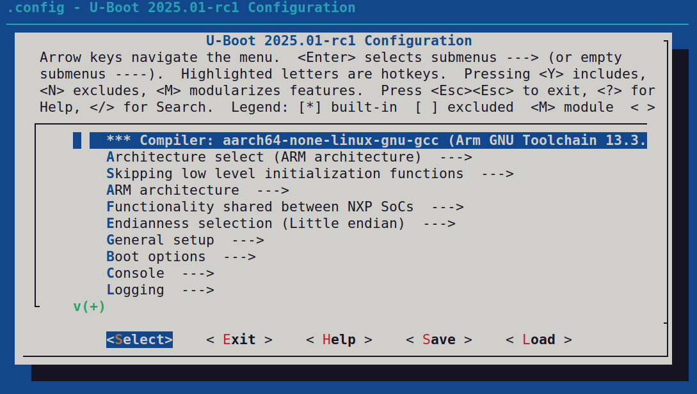
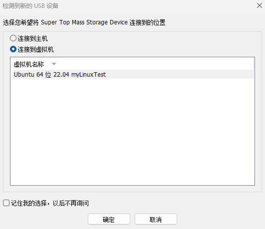

# 构建自己的Linux
本文旨在服务于**==2025赛季华南虎战队==**电控镖电控平台。
目标芯片：RK3399
## 获取交叉编译工具链
交叉工具链Toolchain有多种获取方式，最个人化的方式是自行配置编译出toolchain，鉴于笔者能力
该方案暂挖个坑。本文将使用从**ARM获取**的toolchain。
[ARM toolchain下载链接](https://developer.arm.com/Tools%20and%20Software/GNU%20Toolchain#Technical-Specifications)
根据我们的环境选择**x86_64 Linux hosted cross toolchains**下的**AArch64 GNU/Linux target (aarch64-none-linux-gnu)**，即在x86 Linux主机上使用目标平台为arm64架构，os为Linux。
下载得压缩包后使用以下命令解压
```shell
$xz -d ***.tar.xz
$tar -xvf ***.tar
```
( \*\*\*为工具链压缩包名字 )
本文以**arm-gnu-toolchain-13.3rel1-x86_64-aarch64-none-linux-gnu.tar.xz**为例
解压得文件夹


### 配置环境变量
打开.bashrc
`$sudo gedit ~/.bashrc`
在末尾添加
```
export ARCH=arm64
export CROSS_COMPILE=aarch64-none-linux-gnu-
export PATH=$PATH:/.../arm-gnu-toolchain-13.3.rel1-x86_64-aarch64-none-linux-gnu/bin
```
其中...应为你自己的路径
可以进入上一步解压得到的文件夹的bin文件目录,使用`pwd`命令获得路径

编辑完后save文件,使用以下命令刷新环境配置
`sudo source ~/.bashrc`
再使用`echo`命令验证
成功后效果如下

可以使用以下命令查看toolchain
`aarch64-none-linux-gnu-gcc -v`
至此工具链配置完毕。
## 编译uboot
### 获取uboot源码
可以选择以下3种途径获取uboot源码
[uboot官方代码库主分支](https://gitlab.denx.de/u-boot/u-boot.git)
[uboot官方代码库Rockchip分支](https://gitlab.denx.de/u-boot/custodians/u-boot-rockchip.git)
[Rockchip代码库](https://github.com/rockchip-linux/u-boot.git)
执行相应`git clone`命令即可
RK芯片还需要下载
[RK ATF](https://github.com/rockchip-linux/rkbin)

> [!NOTE]
>
> 本文使用的是[uboot官方代码库Rockchip分支](https://gitlab.denx.de/u-boot/custodians/u-boot-rockchip.git)

### uboot的配置
环境配置
```shell
sudo apt-get install build-essential		//编译环境
sudo apt-get install bison flex swig libssl-dev libgnutls28-dev
pip install pyelftools
sudo apt-get install libncurses5-dev		//图形化库
```
载入配置
`make <board_name>_defconfig`
图形化配置
`make menuconfig`

主界面上方的英文就是简单的操作说明，操作方法如下：

-- 通过键盘上的向上和向下按键选择要配置的菜单，“Enter"按键进入
-- 选中后按下"Y"键就会将相应的代码编译进uboot中，菜单前面变为<*>
-- 选中后按下"N"键就会取消编译相应的代码
-- 选中后按下"M"键就会将相应的代码编译为模块，菜单前面变为< M >
-- 按两下"Esc"键退出，也就是返回到上一级
-- 按下"?"键查看选中菜单的帮助信息
-- 按下"/"键打开搜索框，可在搜索框输入要搜索的内容

在配置界面下方有五个按钮，其功能如下：

-- < Select >：选中按钮，和enter按键功能相同
-- < Exit >：退出按钮，和esc按键功能相同
-- < Help >：帮助按钮，查看选中菜单的帮助信息
-- < Save >：保存按钮，保存修改后的配置文件
-- < Load >：加载按钮，加载指定的配置文件

### uboot配置保存
图形化配置Save退出后，配置会写入.config，如需要保存至defconfig，使用`make savedefconfig`，会在根目录生成defconfig文件，改名移动到/configs文件夹即可。

### uboot的修改
#### dts
1. 在`/<uboot>/dts/upstream/src/arm64/rockchip`文件目录下添加dts文件（scut_dart.dts）
2. 在`/<uboot>/arch/<arch>/dts`文件目录下添加u-boot.dtsi文件（scut_dart-u-boot.dtsi）
3. 修改defconfig Default Device Tree 为`rockchip/scut_dart`
4. 修改DEFAULT_FDT_FILE 为`rockchip/scut_dart.dtb`

#### DDR适配
1. 开启LPDDR4支持
2. 修改DTS使用LPDDR4，打开`/u-boot/arch/arm/dts`中的`scut_dart-u-boot.dtsi`，修改`#include "rk3399-sdram-ddr3-1333.dtsi"`为`#include "rk3399-sdram-lpddr4-100.dtsi"`

#### autoboot delay
Boot option > Autoboot options > (5) delay in seconds before automatically booting
> [!NOTE]
>
> 方便进入uboot调试，后续可以调小

### uboot编译
编译相关命令
```shell
//清除工程
make ARCH=arm CROSS_COMPILE=aarch64-none-linux-gnu- distclean
//配置工程
make ARCH=arm CROSS_COMPILE=aarch64-none-linux-gnu- <board_name>_defconfig
//编译uboot，使用16核编译
make ARCH=arm CROSS_COMPILE=aarch64-none-linux-gnu- -j16
```
> [!NOTE]
>
> <board_name>为目标板配置名字

#### 获得u-boot.img和u-boot.itb

首先拷贝rkbin文件夹`rkbin/bin/rk33/rk3399-bl31-v1.36.elf`到uboot根目录，同时改名为`atf-bl31`（或其他名字，然后执行`export BL31=(name)`）
再执行相应的编译指令即可
至此得到u-boot.img和u-boot.itb

#### 获得idbloader.img
idbloader.img需要烧录到内存0x40地址（Stage 2），然后需要uboot.img用于Stage 3.
##### uboot TPL/SPL打包获得
```shell
tools/mkimage -n rkxxxx -T rksd -d tpl/u-boot-tpl.bin idbloader.img
cat spl/u-boot-spl.bin >> idbloader.img
```
至此获得idbloader.img

##### 获取RK发布的eMMC idbloader
wait...
##### 打包RK binary库获得
wait...
### 烧录测试uboot
#### WMware虚拟机挂载TF卡

> [!NOTE]
>
> 使用USB读卡器


输入命令`sudo fdisk -l`查看是否加载成功
假定SD卡挂载为`/dev/sdb`
执行下列指令

```shell
dd if=idbloader.img of=sdb seek=64
dd if=u-boot.itb of=sdb seek=16384
```

> [!CAUTION]
>
> sdb为sd卡本体，不要选择sd卡分区，如`/dev/sdb1`，`/dev/sdb2`，一定要选择非分区`/dev/sdb`.

确保数据写入
```shell
sync
```
将SD卡插入开发板，上电观察调试串口输出。
## 编译kernal
### 下载源码
[kernel官网](https://www.kernel.org/)

>[!NOTE]
>
>本文使用当前最新Stable版本，6.11.6

### 解压源码
```shell
tar -zxvf ***.tar.gz
```

### kernel配置（裁剪）

### kernel编译
```shell
//清除工程
make ARCH=arm64 CROSS_COMPILE=aarch64-none-linux-gnu- distclean
//配置工程
make ARCH=arm64 CROSS_COMPILE=aarch64-none-linux-gnu- <config_name>
//编译uboot，使用16核编译
make ARCH=arm64 CROSS_COMPILE=aarch64-none-linux-gnu- -j16
```

### 获得boot.img
执行下述命令
```shell
mkdir boot
cp /<kernel>/arch/arm64/boot/dts/rockchip/rk3399-evb.dtb boot/rk3399.dtb
cp /<kernel>/arch/arm64/boot/Image boot/
```
添加extlinux/extliunx.conf
```shell
mkdir boot/extlinux
vi boot/extlinux/extlinux.conf
```
输入
```
label rockchip-kernel-6.11
	kernel /Image
	fdt /rk3399.dtb
	append earlycon=uart8250,mmio32,0xff1a0000 root=PARTUUID=B921B045-1D rootwait rootfstype=ext4 init=/sbin/init
```
文件结构如下
```
boot
├── extlinux
│   └── extlinux.conf
├── Image
└── rk3399-evb.dtb
```
使用下述命令生成ext2fs boot.img
```shell
genext2fs -b 32768 -B $((32*1024*1024/32768)) -d boot/ -i 8192 -U boot.img
```
> [!NOTE]
>
> 此处可能需要安装genext2fs，输入`sudo apt install genext2fs`安装

### 烧录测试
```shell
dd if=boot.img of=sdb seek=32768
```
### 启动测试
使用genext2fs生成boot.img后，在u-boot中使用下述命令
```
gpt write mmc 0 $partitions
```
> [!NOTE]
>
> 数字`0`根据实际mmc号修改，可通过`mmc list`查看

启动
```
boot
````

## 编译rfs
### 制作文件系统
本文使用Buildroot工具制作文件系统
#### 获取Buildroot
```shell
git clone https://git.buildroot.org/buildroot
```
#### 配置Buildroot
```shell
make clean
make menuconfig
```
#### 生成rootfs.tar
```shell
make
```
> [!NOTE]
>
> 可能需要较长时间

#### 获得rootfs.img
将rootfs.tar解压至`rootfs`目录
执行下述命令
```shell
dd if=/dev/zero of=rootfs.img bs=1M count=2000
sudo mkfs.ext4 -F -L linuxroot rootfs.img
mkdir tmpfs
sudo mount rootfs.img tmpfs/
sudo cp -rfp rootfs/* tmpfs/
sudo umount tmpfs/					//
sudo e2fsck -p -f rootfs.img		//检测ext4文件系统正确性
sudo resize2fs -M rootfs.img		//调整文件系统大小
```
#### 启动测试
上电如果kernel能够启动，但是任然无法挂载rootfs，可能是kernel不知道文件系统位置，需要更改boot.img中的extlinux.conf
修改
`root=PARTUUID=B921B045-1D`
为
`root=/dev/mmcblk1p5`
> [!NOTE]
>
> mmcblk**1**p**5** 1代表设备1，5代表分区5，根据实际进行修改

## 烧录
### 启动自SD/TF卡
烧录设备：Linux PC
假定SD卡挂载为`/dev/sdb`
执行下列指令

```shell
dd if=idbloader.img of=sdb seek=64
dd if=u-boot.itb of=sdb seek=16384
dd if=boot.img of=sdb seek=32768
dd if=rootfs.img of=sdb seek=262144
```
> [!CAUTION]
>
> sdb为sd卡本体，不要选择sd卡分区，如`/dev/sdb1`，`/dev/sdb2`，一定要选择非分区`/dev/sdb`.

确保数据写入

```shell
sync
```
修改kernel cmdline
```
append  earlyprintk console=ttyS2,115200n8 rw root=/dev/mmcblk1p7 rootwait rootfstype=ext4 init=/sbin/init
```
写入GPT分区
```
gpt write mmc 0 $partitions
```

### 启动自eMMC


## 制作镜像